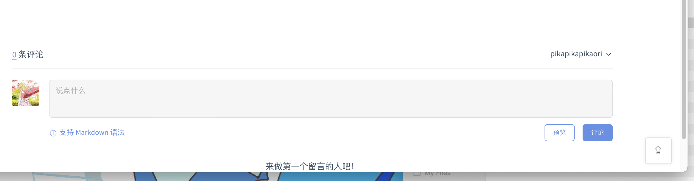
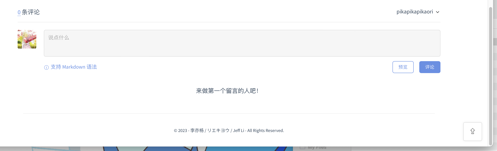

# docsify-gitalk-with-footer

<p align="center">
  
  <br />
  <code>docsify-gitalk-with-footer</code>
</p>

English | [中文](README_zh-cn.md)

This is a plugin to enhance gitalk for docsify.

## What Problem to Solve

If you have tried gitalk plugin according to [here](https://docsify.js.org/#/plugins?id=gitalk), you'll find that several problems exists, which are:

- The gitalk is rendered to the bottom of the whole page, therefore it may look like this:

    

    There is hardly no spacing between the bottom of gitalk and the bottom of the wholepage, and:

- As docsify refresh pages partly while using hash mode, gitalk won't be able to refetch the actual comments under each page. As a result, readers may comment under wrong articles.

## After Using This Plugin

This plugin adds a footer under gitalk, like this:



Besides, this plugin also force the browser to render gitalk each time after router change, so gitalk will show the correct comments according to different articles.

## Pre-Action

Apply for [Github OAuth application](https://github.com/settings/applications/new)

## To Use

In `index.html`, add:

```html
<!-- docsify-gitalk-with-footer plugin -->
<link rel="stylesheet" href="//cdn.jsdelivr.net/npm/gitalk/dist/gitalk.css" />
<script src="//cdn.jsdelivr.net/npm/gitalk/dist/gitalk.min.js"></script>
<script src="https://cdn.jsdelivr.net/gh/pikapikapikaori/docsify-gitalk-with-footer/src/gitalkWithFooter.js"></script>
```

Add settings, please **do not add `id` in `gitalkConfig`**:

```js
window.$docsify = {
    gitalkWithFooter: {
        footerInnerHtml: "<p>text</p>",
        gitalkConfig: {
            clientID: '', // Your Client Id
            clientSecret: '', // Your Client secret
            repo: '',
            owner: '',
            admin: [''],
            // facebook-like distraction free mode
            distractionFreeMode: false,
        }
    },
}
```

| Attribute       | Type   | Description                                       |
| --------------- | ------ | ------------------------------------------------- |
| footerInnerHtml | String | Footer content, of course you can use html string. |
| gitalkConfig    | Object | Please refer to gitalk document.                  |

## Related Reference

1. [Gitalk Document](https://github.com/gitalk/gitalk):

    ```js
    const gitalk = new Gitalk({
        clientID: 'GitHub Application Client ID',
        clientSecret: 'GitHub Application Client Secret',
        repo: 'GitHub repo',      // The repository of store comments,
        owner: 'GitHub repo owner',
        admin: ['GitHub repo owner and collaborators, only these guys can initialize github issues'],
        id: location.pathname,      // Ensure uniqueness and length less than 50
        distractionFreeMode: false  // Facebook-like distraction free mode
    })
    ```
