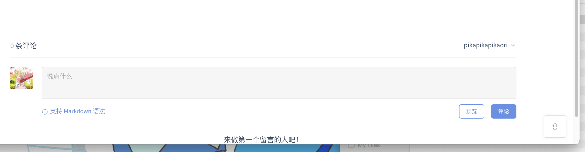
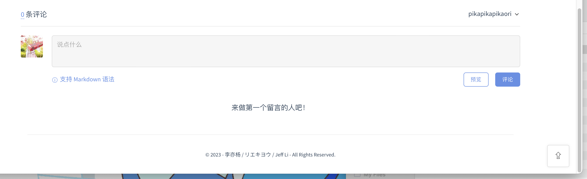

# docsify-gitalk-with-footer

<p align="center">
  
  <br />
  <code>docsify-gitalk-with-footer</code>
</p>

 

[English](/) | 中文

这是一款为dcosify增强gitalk功能的插件

## 解决的问题

如果你按照docsify[官方文档](https://docsify.js.org/#/plugins?id=gitalk)设置了gitalk，你会发现以下的问题：

- gitalk被渲染在整个页面底部，其最下方文字与页面底部几乎没有距离：

    

- 由于docsify默认采取哈西模式路由，页面更改时仅刷新页面局部，因而gitalk并未能来得及重新更改页面获取到的`id`，从而导致了如果你不进行页面刷新的话，评论区所关联的文章可能并不正确。

## 本插件的使用效果

本插件在gitalk下方添加了一个footer，如：



此外，本插件也强制在docsify路由更改时重新渲染gitalk，使得gitalk的评论显示正确。

## 前置动作

申请[Github OAuth application](https://github.com/settings/applications/new)

## 使用方法

`index.html`中添加:

```html
<!-- docsify-gitalk-with-footer plugin -->
<link rel="stylesheet" href="//cdn.jsdelivr.net/npm/gitalk/dist/gitalk.css" />

<script src="//cdn.jsdelivr.net/npm/gitalk/dist/gitalk.min.js"></script>
<script src="https://cdn.jsdelivr.net/gh/pikapikapikaori/docsify-gitalk-with-footer@latest/src/gitalkWithFooter.js"></script>
```

添加以下设置。注意，请**不要在`gitalkConfig`中添加`id`的设置**:

```js
window.$docsify = {
    gitalkWithFooter: {
        footerInnerHtml: "<p>text</p>",
        gitalkConfig: {
            clientID: '', // Your Client Id
            clientSecret: '', // Your Client secret
            repo: '',
            owner: '',
            admin: [''],
            // facebook-like distraction free mode
            distractionFreeMode: false,
        }
    },
}
```

| 属性            | 类型   | 描述                           |
| --------------- | ------ | ------------------------------ |
| footerInnerHtml | String | footer内容，可以使用html字符串 |
| gitalkConfig    | Object | 请参考gitalk官方文档           |

## 相关资料

1. [Gitalk文档](https://github.com/gitalk/gitalk):

    ```js
    const gitalk = new Gitalk({
        clientID: 'GitHub Application Client ID',
        clientSecret: 'GitHub Application Client Secret',
        repo: 'GitHub repo',      // The repository of store comments,
        owner: 'GitHub repo owner',
        admin: ['GitHub repo owner and collaborators, only these guys can initialize github issues'],
        id: location.pathname,      // Ensure uniqueness and length less than 50
        distractionFreeMode: false  // Facebook-like distraction free mode
    })
    ```

## 其他

如果您有对[本项目](https://github.com/pikapikapikaori/docsify-gitalk-with-footer)的优化，欢迎提交PR。

如果您喜欢本插件，可以给我点个star，谢谢！

我开发的一些其他工具可以参考[我的博客](https://pikapikapikaori.github.io/pikapikapi-blog/#/ITtech/)。
